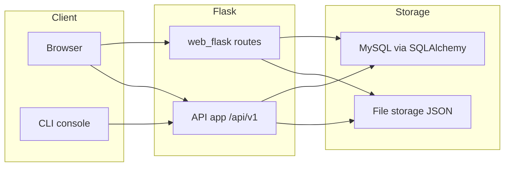

# AirBnB Clone v3

<p align="center">
	
</p>

Modernized Python version of the HBnB project featuring a command-line console, a REST API, a Flask web frontend, pluggable storage engines (JSON file or MySQL), and helper scripts for packaging and deployment.

- Console to manage objects locally
- REST API under `/api/v1` with CORS
- Flask routes and Jinja templates under `web_flask/`
- Two storage engines: file-based JSON and MySQL via SQLAlchemy
- Packaging and deployment helpers for static assets

> [!NOTE]
> This README focuses on running and using the project. For environment variables and deployment details, see `docs/ENV_VARS.md` and `docs/DEPLOYMENT.md`.

## Contents

- Quick start
- Project structure
- Run modes
  - Console (CLI)
  - REST API
  - Flask web app
  - Static site
- Storage engines and DB setup
- Testing
- Troubleshooting

## Quick start

Prerequisites:

- Python 3.8+
- pip and venv
- Optional for DB storage: MySQL 5.7+/8.0 and user/database created (see `setup_mysql_dev.sql`)

Install dependencies (minimal set used by this repo):

```bash
python3 -m venv .venv
. .venv/bin/activate
pip install --upgrade pip
pip install -r requirements.txt

# Optional (for packaging/deploy scripts written against Fabric 1 API):
# Prefer fabric3 (Fabric 1.x for Python 3). If unavailable on your system, try:
pip install fabric3 || pip install 'fabric<2'
```

Clone and enter the project:

```bash
git clone https://github.com/Iadolphe007/AirBnB_clone_v3.git
cd AirBnB_clone_v3
```

## Project structure

```text
api/                 # Flask app exposing the REST API (Blueprint mounted at /api/v1)
models/              # Core domain models and storage engines
web_flask/           # Flask routes + Jinja templates for HBnB pages
web_static/          # Static HTML/CSS for early UI version
0-setup_web_static.sh  # Nginx+folders bootstrap for static deploy
1-pack_web_static.py   # Tarball builder for web_static
2-do_deploy_web_static.py  # Upload/extract static tarball to servers
3-deploy_web_static.py     # Pack + deploy in one go
console.py           # Interactive command interpreter (CLI)
setup_mysql_*.sql    # Helper SQL scripts to create DB/users
```

### High-level architecture



## Run modes

### 1) Console (CLI)

```bash
python3 console.py
(hbnb) help
(hbnb) create User email="user@example.com" password="secret"
```

Supported commands include: `create`, `show`, `all`, `update`, `destroy`, `count`.

### 2) REST API

Entry point: `api/v1/app.py`.

Environment variables:

- `HBNB_API_HOST` (default: 0.0.0.0)
- `HBNB_API_PORT` (default: 5000)
- Storage selection: see Storage section below

Run:

```bash
export HBNB_API_HOST=0.0.0.0
export HBNB_API_PORT=5000
python3 -m api.v1.app
```

Quick smoke test:

```bash
curl -s http://127.0.0.1:5000/api/v1/status | jq .
curl -s http://127.0.0.1:5000/api/v1/stats | jq .
```

### 3) Flask web app (routes/templates)

Each file under `web_flask/` is a runnable script. Example:

```bash
python3 -m web_flask.0-hello_route
# then open http://127.0.0.1:5000/
```

See `web_flask/README.md` for the list of available routes and templates.

### 4) Static site

Open the static pages in `web_static/*.html` directly in your browser, or serve them from Nginx using the provided deploy scripts (see `docs/DEPLOYMENT.md`).

## Storage engines and DB setup

The project supports two storage backends via `models.storage`:

- File storage: JSON file at `file.json` (default)
- DB storage: MySQL with SQLAlchemy

Select the backend using `HBNB_TYPE_STORAGE`:

```bash
# File storage (default)
export HBNB_TYPE_STORAGE=file

# DB storage
export HBNB_TYPE_STORAGE=db
export HBNB_MYSQL_USER=hbnb_dev
export HBNB_MYSQL_PWD=hbnb_dev_pwd
export HBNB_MYSQL_HOST=127.0.0.1
export HBNB_MYSQL_DB=hbnb_dev_db

# One-time DB prep
mysql -u root -p < setup_mysql_dev.sql
```

> [!IMPORTANT]
> When `HBNB_TYPE_STORAGE=db`, be sure MySQL is running and the credentials match your environment. In tests, use `setup_mysql_test.sql`.

## Testing

Run unit tests:

```bash
python3 -m unittest discover -v tests
```

## Troubleshooting

- API starts but CORS blocked: CORS is enabled for `/api/*` from origin `0.0.0.0`. Adjust in `api/v1/app.py` if needed.
- Fabric import errors: these scripts were authored for Fabric 1.x. Use `fabric3` on Python 3, or install `fabric<2`.
- MySQL connector errors: ensure `mysqlclient` and system headers are installed (on Debian/Ubuntu: `sudo apt-get install libmysqlclient-dev` before `pip install mysqlclient`).

## Authors

- Imanishimwe Adolphe (@Iadolphe007)
- Joel Muhoho (@joekariuki3)
